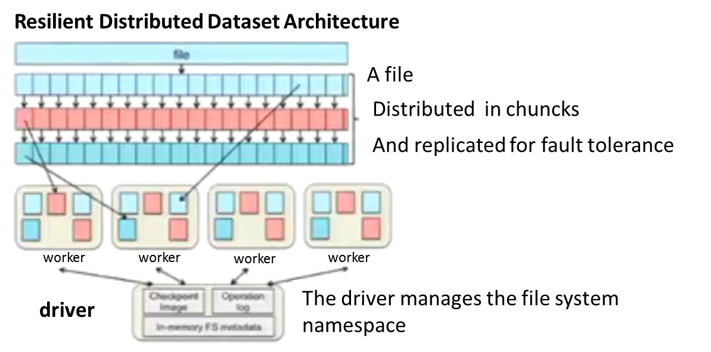
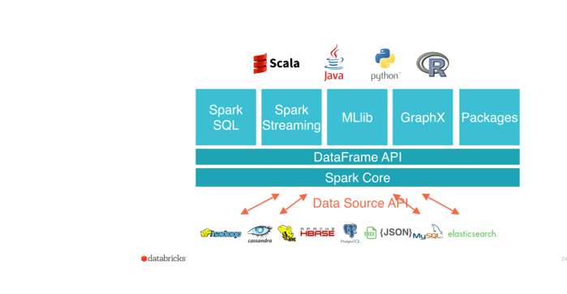
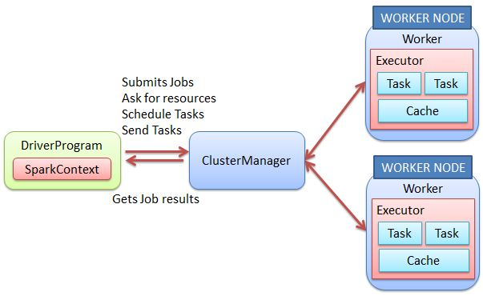

# Introduction to [a]Spark / PySpark   ([**Slides**](../slides/spark))

**Spark** is a general purpose cluster computing framework:
- it provides efficient in-memory computations for large data sets 
- it distributes **computation** and **data** across multiple computers. 

## Data Distribution

To distribute data, Spark uses a framework called *Resilient Distributed Datasets* (**RDDs**). 

For instance, if you read a file with Spark, it will automatically create a RDD. 

But a RDD is **immutable** so to modify it a new RDD needs to be created. 

That is very helpful for **reproducibility**!

## Computation Distribution

To distribute computation, Spark API (Application Program Interface) available in multiple programming
languages (Scala, Java, Python and R) provides several operators such as map and reduce. 

The figure below shows the Spark Software Layers.

**Spark Core** contains the basic functionality of Spark; in particular the APIs that define RDDs and the 
operations and actions that can be undertaken upon them (map, filter, reduce, etc.). 

The rest of Spark's libraries are built on top of the RDD and Spark Core:

- **Spark SQL** for SQL and structured data processing.  Every database table is represented as an RDD and Spark SQL queries are transformed into Spark operations.
- **MLlib** is a library of common machine learning algorithms implemented as Spark operations on RDDs. This library contains scalable learning algorithms like classifications, regressions, etc. 
that require iterative operations across large data sets. 
- **GraphX** is a collection of algorithms and tools for manipulating graphs and performing parallel graph operations 
and computations. 

- **Spark Streaming** for scalable, high-throughput, fault-tolerant stream processing of real-time data. 

The python Spark API for these different Software Layers can be found [here](https://spark.apache.org/docs/2.0.2/api/python/index.html).

&nbsp;

# Spark Initialization: Spark Context

Spark applications are run as independent sets of processes, coordinated by a **Spark Context** in a driver program.

It may be automatically created (for instance if you call pyspark from the shells (the Spark context is then called *sc*).

But we haven't set it up automatically in the Galaxy eduPortal, so you need to define it:

~~~
from pyspark import SparkContext
sc = SparkContext('local', 'pyspark tutorial') 
~~~
{: .python}

&nbsp;

- the driver (first argument) can be **local[*]**, **spark://", **yarn**, etc. What is available for you depends on how Spark has been
deployed on the machine you use. 
- the second argument is the application name and is a human readable string you choose.

&nbsp;

Because we do not specify any number of tasks for local, it means we will be using one only. To use a maximum of 2 tasks in parallel:

~~~
from pyspark import SparkContext
sc = SparkContext('local[2]', 'pyspark tutorial') 
~~~
{: .python}

If you wish to use all the available resource, you can simply use '*' i.e.

~~~
from pyspark import SparkContext
sc = SparkContext('local[*]', 'pyspark tutorial') 
~~~
{: .python}

Please note that within one session, you cannot define several Spark context! So if you have tried the 3 previous SparkContext examples, don't
be surprised to get an error!
 
&nbsp;

> ## Deployment of Spark:
> 
> It can be deployed on:
> 
> - a single machine such as your laptop (local)
> - a set of pre-defined machines (stand-alone)
> - a dedicated Hadoop-aware scheduler (YARN/Mesos)
> - "cloud", e.g. Amazon EC2
>
> The development workflow is that you start small (local) and scale up to one of the other solutions, depending on your needs and resources.
>
>
> At [UIO](http://www.uio.no), we have the [Abel cluster](http://www.uio.no/english/services/it/research/hpc/abel/) 
> where [Spark](http://www.uio.no/english/services/it/research/hpc/abel/help/software/Spark.html) is available. 
> 
> 
> **Often, you don't need to change *any* code to go between these methods of deployment!**
>
{: .callout}

# map/reduce

Let's start from our previous *map* example where the goal was to convert temperature from Celcius to Kelvin.

Here it is how it translates in PySpark.

~~~
temp_c = [10, 3, -5, 25, 1, 9, 29, -10, 5]
rdd_temp_c = sc.parallelize(temp_c)
rdd_temp_K = rdd_temp_c.map(lambda x: x + 273.15).collect()
print(rdd_temp_K)   
~~~
{: .python}

You recognize the *map* function (please note it is not the pure python *map* function but PySpark *map* function). 
It acts here as the **transformation** function while *collect* is the **action**. It *pulls* all elements of 
the RDD to the driver.

> ## Remark:
> 
> It is often a very bad idea to pull all the elements of the RDD to the driver because we potentially handle very large
> amount of data. So instead we prefer to use *take* as you can specify how many elements you wish to pull from the RDD.
>
> For instance to pull the first 3 elements only:
>
> ~~~
> temp_c = [10, 3, -5, 25, 1, 9, 29, -10, 5]
> rdd_temp_c = sc.parallelize(temp_c)
> rdd_temp_K = rdd_temp_c.map(lambda x: x + 273.15).take(3)
> print(rdd_temp_K)   
> ~~~
> {: .python}
{: .callout}

> ## Challenge 
>
>  
>
> ~~~
> def mod(x):
>     import numpy as np
>     return (x, np.mod(x, 2))
> 
> Nmax=1000
> rdd = sc.parallelize(range(Nmax)).map(mod).take(5)
> print(rdd)
> ~~~
> {: .python}
>
> Try the example above with different values for Nmax. Does it change the execution time if you take very large value for Nmax?
>
> Why?
>
> > ## Solution to Challenge 1
> > 
> > **Transformations** are executed after **actions** and here we select 5 values only (*take(5)*) so whatever the number of Nmax, 
> > Spark executes exactly the same number of operations.
> > 
> > ~~~
> > def mod(x):
> >   import numpy as np
> >   return (x, np.mod(x, 2))
> > 
> > Nmax= 10000000000
> > rdd = sc.parallelize(range(Nmax)).map(mod).take(5)
> > print(rdd)
> > ~~~
> > {: .python}
> {: .solution}
{: .challenge}

Now let's take another example where we use *map* as the **transformation** and *reduce* for the **action**. 

~~~
# we define a list of integers
numbers = [1, 4, 6, 2, 9, 10]

rdd_numbers=sc.parallelize(numbers)

# Use reduce to combine numbers
rdd_reduce = rdd_numbers.reduce(lambda x,y: "(" + str(x) + ", " + str(y) + ")")
print(rdd_reduce)
~~~
{: .python}

&nbsp;

# Create a RDD from a file

Most of the time, we need to process data we have stored as "standard" files. Here we learn how to create a RDD from a file. 
Import a file from the Data Library " in a new history (call it for instance "Gutenberg"):
- Tab "Shared Data" --> "Data Libraries" -->  "Project Gutenberg"
- Select a file (or the three of them if you wish)
- Click to "To History" and import to a new History that you call "Gutenberg".
- Go to your newly created History (click on the green box that appears on your screen)
- Open a new jupyter notebook from your file and change the kernel froom python 2 to python 3.

~~~
from pyspark import SparkContext
sc = SparkContext('local[2]', 'pyspark tutorial') 

lines_rdd = sc.textFile(get(1))
~~~
{: .python}

The method *textFile" load the file passed as an argument and returns a RDD. Please note that you may add 
a second argument to specify the minimum number of partitions for your RDD. If not specified, you let Spark decides.

In the following example, we load a text file as a RDD and counts how many times does each word appear.

~~~
from pyspark import SparkContext
import str

sc = SparkContext('local[2]', 'pyspark tutorial') 

def noPunctuations(text):
    """Removes punctuation and convert to lower case
    Args:
        text (str): A string.
    Returns:
        str: The cleaned up string.
    """
    return text.translate(str.maketrans("","",string.punctuation)).lower()

lines_rdd = sc.textFile(get(1), 1)
counts = lines_rdd.map(noPunctuations).flatMap(lambda x: x.split(' ')) \
         .map(lambda x: (x, 1)) \
		 .reduceByKey(lambda x, y: x+y)
		 
for (word, count) in counts.collect():
   print(word,count)
~~~
{: .python}
  
&nbsp;

> ## map vs. flatMap and reduce vs. reduceByKey:
> 
> In the previous example, we used *flatMap* as a **transformation** function and *reduceByKey* as an action.   
>
> *map*: It returns a new RDD by applying a function to each element of the RDD.   Function in map can return only one item.
> *flatMap*:  It returns a new RDD by applying  a function to each element of the RDD, but output is flattened.
> Also, function in flatMap can return a list of elements (0 or more)
>
> ~~~
> sc.parallelize([3,4,5]).map(lambda x: range(1,x)).collect()
> ~~~
> {: .python} 
> 
> ~~~
> [[1, 2], [1, 2, 3], [1, 2, 3, 4]]
> ~~~
> {: .output} 
>
> ~~~
> sc.parallelize([3,4,5]).flatMap(lambda x: range(1,x)).collect()
> ~~~
> {: .python} 
> 
> ~~~
> [1, 2, 1, 2, 3, 1, 2, 3, 4] 
> ~~~
> {: .output} 
> 
> *reduceByKey* is very often used as it combines values with the same key. In our example, we wanted to
> count the number of occurence of the same word. A simple reduce would not differentiate the different words 
> and would count the total number of words.
>
{: .callout}
 

# Spark SQL

**Spark SQL** is a component on top of **Spark Core** that facilitates processing of structured and semi-structured data
and the integration of several data formats as source (Hive, Parquet, JSON).

It allows to transform RDDs using SQL (Structured Query Language).

To start **Spark SQL** within your notebook, you need to create a *SQL context*.

For this exercise, import a JSON file in a new history "World Cup". 
You can find the historical World cup player dataset in JSON format in our Data Library named
"Historical world cup player data  ".

Then create a new python 3 (change kernel if set by default to python 2) jupyter notebook from this file:
 
~~~
from pyspark import SparkContext
from pyspark.sql import SQLContext

sc = SparkContext('local', 'Spark SQL') 
sqlc = SQLContext(sc)
~~~
{: .python}

We can read the JSON file we have in our history and create a DataFrame (*Spark SQL* has a json reader available):
 
~~~
players = sqlc.read.json(get(1))

# Print the schema in a tree format

players.printSchema()

" Select only the "FullName" column
players.select("FullName").show(20)
~~~
{: .python}

~~~
+--------------------+
|            FullName|
+--------------------+
|        Ãngel Bossio|
|        Juan Botasso|
|      Roberto Cherro|
|   Alberto Chividini|
|                    |
|                    |
|       Juan Evaristo|
|      Mario Evaristo|
|     Manuel Ferreira|
|          Luis Monti|
|                    |
|   Rodolfo Orlandini|
|Fernando Paternoster|
|   Natalio Perinetti|
|     Carlos Peucelle|
|     Edmundo Piaggio|
|  Alejandro Scopelli|
|      Carlos Spadaro|
|                    |
|                    |
+--------------------+
only showing top 20 rows
~~~
{: .output}

Then we can create a view of our DataFrame. The lifetime of this temporary table is tied to the SparkSession that was used to create this DataFrame.

~~~
players.registerTempTable("players")
~~~
{: .python}

We can then query our view; for instance to get the names of all the Teams:

~~~
sqlc.sql("select distinct Team from players").show(10)
~~~
{: .python}

~~~
+--------+
|    Team|
+--------+
|England |
|Paraguay|
|     POL|
|  Russia|
|     BRA|
| Senegal|
|  Sweden|
|     FRA|
|     ALG|
|  Spain |
+--------+
only showing top 10 rows
~~~
{: .output}

And have the full SQL possibilities to create SQL query:

~~~
# Select the teams names from 2014 only 
team2014 = sqlc.sql("select distinct Team from players where Year == 2014")
#
# The results of SQL queries are Dataframe objects.
# rdd method returns the content as an :class:`pyspark.RDD` of :class:`Row`.
teamNames = team2014.rdd.map(lambda p: "Name: " + p.Team).collect()
for name in teamNames:
    print(name)
~~~
{: .python}

# MLlib

see https://github.com/apache/spark

# GraphX

# Spark Streaming
https://github.com/apache/spark

&nbsp;
&nbsp;
&nbsp;
&nbsp;
